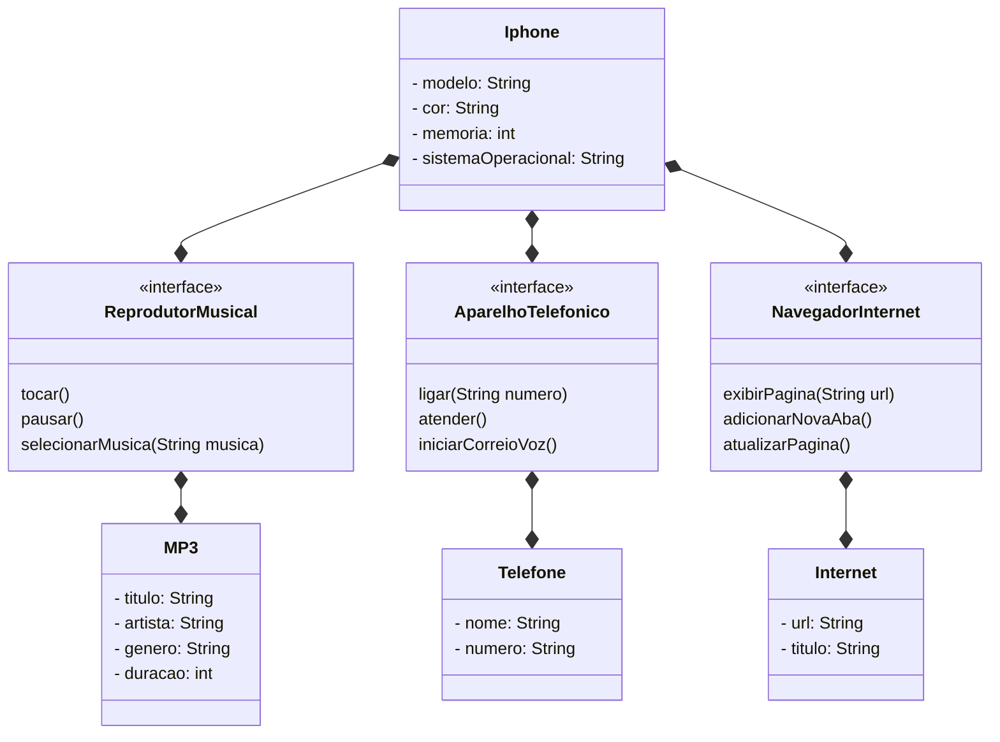

## Autores
- [Igor Ujiie](https://github.com/igorujiie)

## POO - Desafio

### Modelagem e Diagramação do Desafio do README
A partir do Desafio, foi montado este diagrama UML para representar a classe Iphone 

